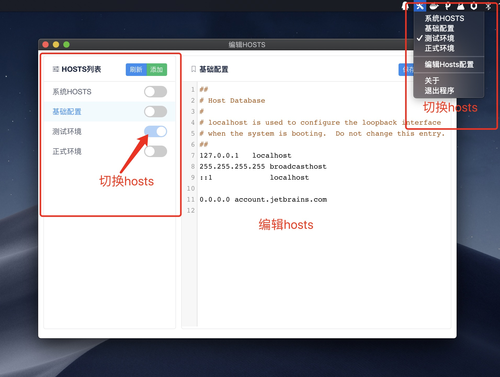

# 切换hosts配置

本程序可以设置基础hosts配置[base.hosts],在基础配置外可以设置对应开发需要的环境配置，点击切换会将基础配置和所选配置合并为一个文件写入到hosts文件中

## mac 打包
make darwin_dmg

打包工具 https://github.com/robertzhouxh/osx-dmg-maker

## 备注
其它平台未测试，当前mac可完美使用
